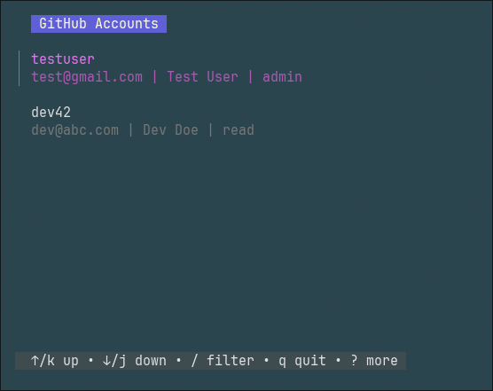

# ⭐ Git Account Manager in CLI
> A custom TUI interface to manager account github and set account locally for each project repo

## 💻 Specs
- IDE: [Visual Studio Code](https://code.visualstudio.com/)
- Language: [Golang](https://go.dev/)
- External packages: 
    - [github.com/charmbracelet/bubbletea](https://github.com/charmbracelet/bubbletea): TUI framework for Golang
    - [github.com/charmbracelet/bubbles](https://github.com/charmbracelet/bubbles): TUI component
    - [github.com/charmbracelet/lipgloss](https://github.com/charmbracelet/lipgloss): Styling terminal layout
- Terminal: [WezTerm](https://wezterm.org/index.html)
- Shell: [fish](https://fishshell.com/)
- Kernel: Linux

## 🚀 Features

- [x] Store account information in text file (.txt), example basic data (username, email, name, scope)
- [x] Read account data and preview into CLI UI
- [x] Setting git config local with selected account information
- [x] Support key press interact (Enter, Up/Down navigate, Delete, Edit, Add, Filter)
- [ ] Add new account
- [ ] Delete account with confirmation prompt
- [ ] Edit account
  - [ ] Table information horizontal layout
  - [ ] Support tabbing to edit account field information (TAB, SHIFT TAB)
  - [ ] Handle validate required fields
- [ ] Toggle Git global config
- [ ] Generate SSH key and attach to account
  - [ ] Set SSH key for git config local
- [ ] Clipboard copy/paste
- [ ] Searching by account field
- [ ] Save created/modified time
  - [ ] Sorting by created/modified time
- [ ] Check Github user existence
- [ ] Generate name based on username when not enter
- [ ] Display list pagination
- [ ] Encrypt account information
- [ ] Add locker to open app
- [ ] Export to YAML/JSON support
- [ ] Interface helper guide

## 📷 Screenshots



## 🛠️ Use Guide

- Run installation script
```bash
./install.sh
```

- The script above will:
  - Install package Go language
  - Add new git alias for run script account manager
  - Create a new file to store account information in somewhere (ex: root)
  - Build Account Manager App
  - Setting Go language env to current shell

- Run the app in terminal
```bash
git acc-manager
```

## 💡 Idea & Inspired
- I got this idea from my colleague's request
- His problem: He is working on many resources: company, personal, and a remote job. For each resource, he must use a different account to authenticate the remote repository. He wants something that can store those accounts and switch between them immediately by hitting a key button (running one command line) instead of writing the same git config local commands over and over again. And it could be great if that process had a cool UI to interact with. That's why this project exists.

## 🧠 AI agent
- [ChatGPT](https://chatgpt.com/) - Free version

## &#128140; Questions? Feature Requests? Contact Me!

<p>&ensp;&raquo;&raquo; MAIL: <a href="mailto:freecodeweb2021@gmail.comm">freecodeweb2021@gmail.com</a></p>
<p>&ensp;&raquo;&raquo; FANPAGE: <a href="https://www.facebook.com/freecodeweb">https://www.facebook.com/freecodeweb</a></p>

## &#128075; Follow me!

<p>&ensp;&raquo;&raquo; YOUTUBE: <a href="https://tinyurl.com/freecodewebchannel">https://tinyurl.com/freecodewebchannel</a></p>
<p>&ensp;&raquo;&raquo; TIPS & TRICKS: <a href="https://bit.ly/3CUsd2J">https://bit.ly/3CUsd2J</a></p>
<p>&ensp;&raquo;&raquo; GITHUB: <a href="https://github.com/lazarus2019">https://github.com/lazarus2019</a></p>
<p>&ensp;&raquo;&raquo; WEBSITE: <a href="https://tinyurl.com/lazarus2018">https://tinyurl.com/lazarus2018</a></p>
<p>&ensp;&raquo;&raquo; LINK TREE: <a href="https://linktr.ee/freecodeweb">https://linktr.ee/freecodeweb</a></p>
 
## &#128373; Join our home now!
<p>&ensp;&raquo;&raquo; GROUP: <a href="https://www.facebook.com/groups/6366019480105972">https://www.facebook.com/groups/6366019480105972</a></p>

## &#128204; Copyright

<p>&copy; &#9889;<a style="font-style: italic;" href="https://www.facebook.com/nts.nguyen.3701/">Lazarus2019 - Krix Daniel</a>&#9889;</p>

